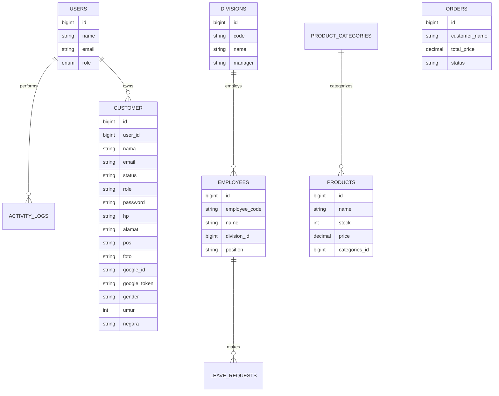

# Kanola Skincare Monitoring System 🌸

<p align="center">
  
</p>

Aplikasi monitoring sistem berbasis Laravel untuk mengelola proses produksi, evaluasi produk, dan pelacakan pesanan masuk (orders) produk Kanola Skincare secara real-time.

---

## Features
* **Dashboard Statistik & Analytics:** Memantau revenue total, total order, customer unik, serta grafik tren penjualan (Chart.js).
* **Autentikasi Multi-Guard & OAuth Terintegrasi:** Memisahkan sesi masuk antara akun Admin/Staf (Backend) dan Customer (Frontend) dengan dukungan fitur login sosial Google via Laravel Socialite.
* **Manajemen Profil Pelanggan & Unggah Foto:** Fitur bagi customer untuk melengkapi data diri (No. HP, Kode Pos, Jenis Kelamin, Umur, Negara, Alamat) beserta foto profil interaktif menggunakan live-preview JavaScript.
* **Manajemen Produk:** Sinkronisasi data antara 14 produk inti aktif termasuk fitur unggah gambar komoditas secara dinamis.
* **Monitoring Produksi & Progres:** Pelacakan persentase tahapan produksi massal.
* **Evaluasi Mutu & Risiko:** Dokumentasi penilaian kualitas produk dari manager dan tim laboratorium.
* **Manajemen Pesanan Terintegrasi:** Penyimpanan data checkout dengan detail list produk berbasis format JSON array terstruktur.

---

## Database Schema (ERD) 🗄️


---

## Installation & Setup Guide 🚀

Ikuti langkah-langkah berikut untuk menjalankan repositori ini di lingkungan lokal Anda:

1. **Clone Repositori:**
```bash
git clone [https://github.com/sshunsin/kanola-skincare.git](https://github.com/sshunsin/kanola-skincare.git)
cd kanola-skincare
```

2. **Instalasi Dependency:**
```bash
composer install
npm install && npm run dev
```

3. **Konfigurasi Environment:**
```bash
cp .env.example .env
php artisan key:generate
```
(Jangan lupa sesuaikan nilai DB_DATABASE, DB_USERNAME, DB_PASSWORD serta konfigurasi Google Client ID & Secret untuk Socialite di file .env)

4. **Migrasi Database:**
```bash
php artisan migrate
```

Jika migrasi gagal maka jalankan perintah ini:
```bash
php artisan migrate:fresh --seed
```

5. **Menjalankan Semua Seeder:**
```bash
php artisan db:seed --class=DatabaseSeeder
```

6. **Membuat tautan Simbolis Storage (Wajib):**
Fitur unggah foto profil pelanggan dan gambar produk membutuhkan tautan direktori publik agar dapat diakses oleh browser:
```bash
php artisan storage:link
```

7. **Jalankan Aplikasi:**
```bash
php artisan serve
```
* Front-end (Customer Auth): http://127.0.0.1:8000/front/v1/login
* Back-end (Admin/Staff Auth): http://127.0.0.1:8000/backend/v1/login

---

## Tech Stack

**Backend Framework: Laravel 12.x**

**Language: PHP 8.2+**

**Database Engine: MySQL / MariaDB**

**Frontend Charting: Chart.js Library via CDN**

**Styling: Tailwind CSS & Custom CSS**

**Fonts & Icons: Google Fonts (Playfair Display) & FontAwesome Icons**

---

## License 📄

Proyek ini dilisensikan di bawah Hak Cipta [MIT License](LICENSE). Anda bebas menggunakannya untuk keperluan personal maupun komersial.
